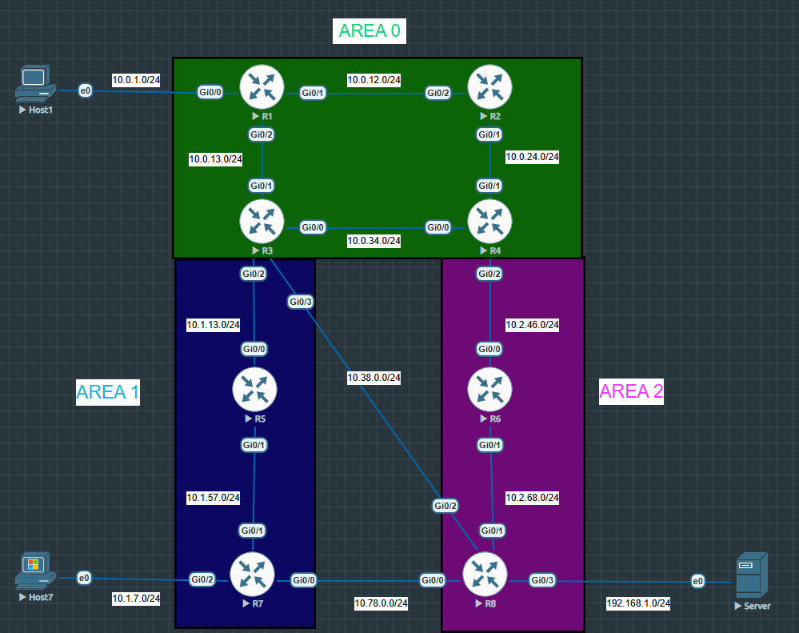

# Multi-Area OSPF Lab on EVE-NG

This repository contains a Cisco OSPF lab built in **EVE-NG**, simulating a multi-area OSPF network with route summarization, stub areas, and prefix filtering. The goal is to reinforce core OSPF concepts through hands-on configuration and verification.

---

## Lab Overview

This lab demonstrates how OSPF behaves in a multi-area design. It covers:

- Neighbor formation and adjacency states  
- Link-state advertisement (LSA) propagation  
- Inter-area routing  
- Route summarization at ABRs  
- Stub and totally stubby area behavior  
- Route filtering using prefix lists and route maps  

---

## Topology

- **Routers**: 8 Cisco IOSv routers (R1–R8)  
- **End Devices**: Host1, Host7  
- **Server**: Connected to R8  
- **Areas**:
  - **Area 0 (Backbone)**: R1, R2, R3, R4  
  - **Area 1**: R5, R7  
  - **Area 2**: R6, R8  

---

## IP Addressing

| Connection         | Subnet         |
|--------------------|----------------|
| Host1 ↔ R1         | 10.0.1.0/24    |
| R1 ↔ R2            | 10.0.12.0/24   |
| R1 ↔ R3            | 10.0.13.0/24   |
| R2 ↔ R4            | 10.0.24.0/24   |
| R3 ↔ R4            | 10.0.34.0/24   |
| R3 ↔ R5            | 10.1.13.0/24   |
| R5 ↔ R7            | 10.1.57.0/24   |
| Host7 ↔ R7         | 10.1.7.0/24    |
| R5 ↔ R6            | 10.38.0.0/24   |
| R4 ↔ R6            | 10.2.46.0/24   |
| R6 ↔ R8            | 10.2.68.0/24   |
| R7 ↔ R8            | 10.78.0.0/24   |
| R8 ↔ Server        | 192.168.1.0/24 |

---

## Lab Objectives

- Establish OSPF adjacencies across all routers  
- Assign routers to correct OSPF areas  
- Configure ABRs and summarize routes where appropriate  
- Convert Area 2 to a totally stubby area  
- Apply route filtering between areas using prefix lists  
- Verify full reachability from Host1 to the Server  

---

## Technologies Used

- **Platform**: EVE-NG (Community Edition)  
- **Routers**: Cisco IOSv  
- **Routing Protocol**: OSPFv2 (IPv4)  

---

## Folder Legend

- `/configs`  
  Contains the Cisco IOSv configuration files for each router, cleaned and ready for lab deployment.

- `/docs`  
  Documentation and notes explaining OSPF concepts, lab design decisions, and troubleshooting tips.

- `/images`  
  Topology diagrams and any relevant visuals used in the lab.

